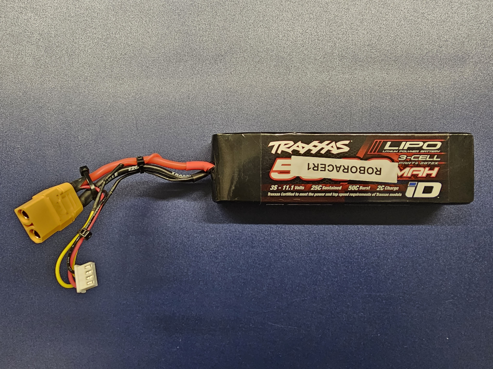
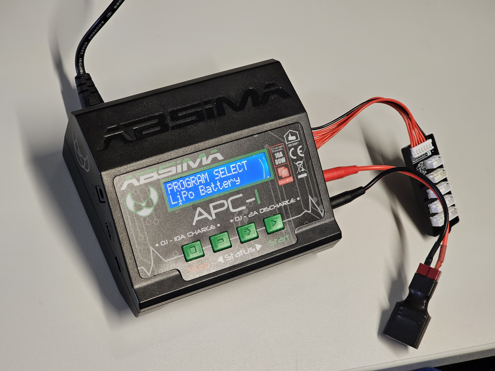
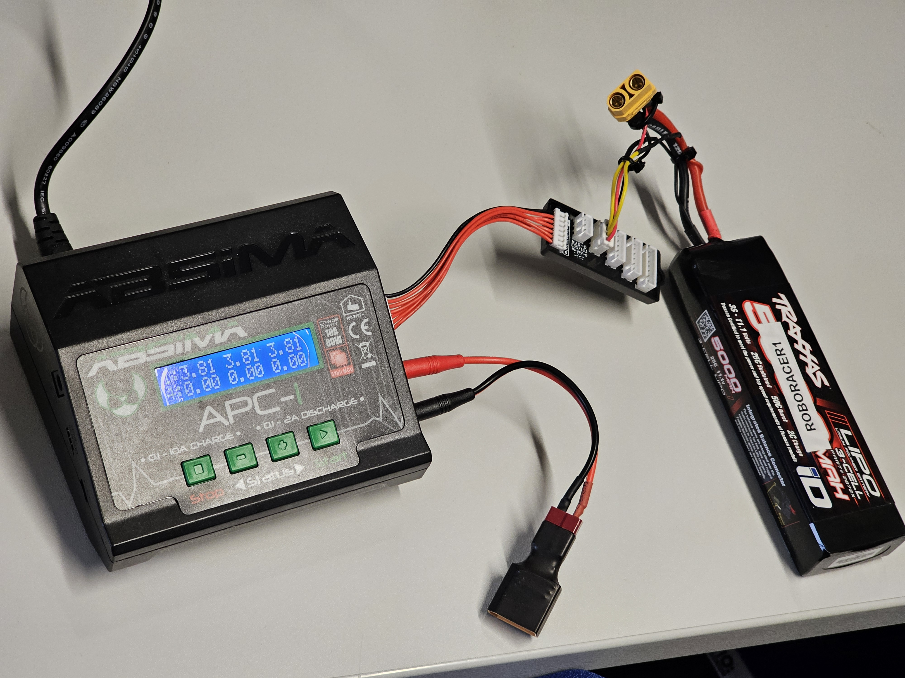
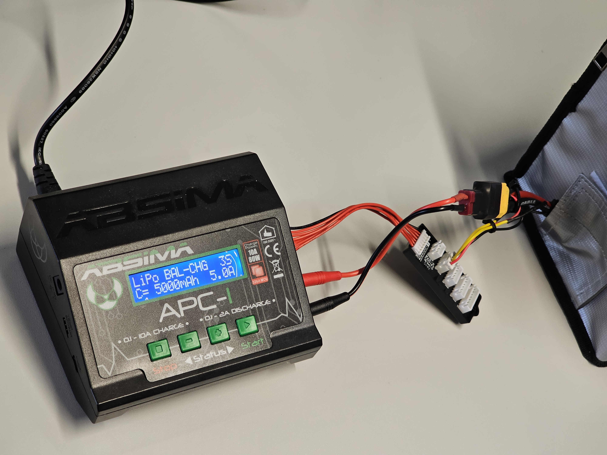
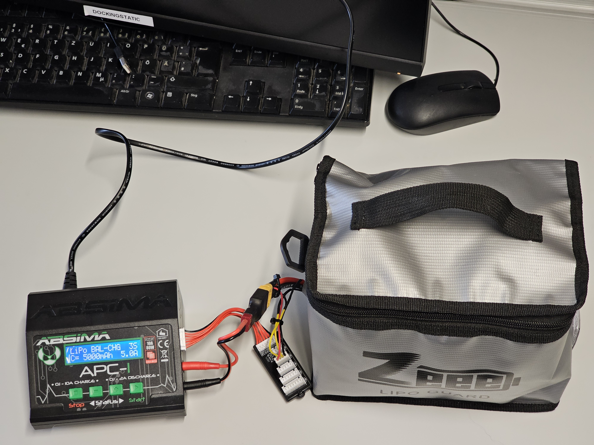

.. _doc_build_charging:

Charging the Battery
=====================
In this section we will be discussing the procedure and safe practices for charging the LiPo battery. 

.. danger::
  Never leave the batteries unattended while charging.

**Equipment Required:**
	* LiPo Battery 
	* Abisma Charging Kit 
	* LiPo Safe Bag 
	* Power Supply 
	
**Approximate Time Investment:** 5 minutes - 45 minutes

The battery used in the car is LiPo (Lithium-Polymer) battery. The battery has 3 cells of 4.2V adding up to a total full charge voltage of 12.6V. 

	
	LiPo Battery

.. note::
  Always make sure not to drain the battery too much before charging so that the cells are not affected (preferably at 11V). 

Charging Setup
-----------------------

Absima Charger is used to charge the battery. 

	
	Charging Kit	
Connect the low voltage cable to the charger. Use the **[+]** and **[-]** buttons to cycle around modes and use the **[Start]** button to select Battery Meter in the charger to measure the cell-wise battery voltage. 

	
	Battery Meter

Place the battery inside the LiPo Safe bag (if necessary place 1 bag of fireballs inside) and close the bag. 

Use the **[+]** and **[-]** buttons to cycle around modes and use the **[Start]** button to select LiPo Battery mode. 
The charger settings should match the battery model and ratings: 
	* Model – LiPo 3S 
	* C=5000mAh 
	* Amps – 5A (for balanced charging) 
	

	
	Charging Configuration

Connect both low voltage and high voltage cables to the charger and start the charging process by pressing and holding the **[Start]** button. 

.. note::
  If the battery is drained too much, unplug the low voltage balancer and configure the charger to 1A.

	LiPo Safe Bag
 
Once charging is complete, reset everything back by pressing the **[Stop]** button and unplug the battery from the charger and the charger from the electric port. 
